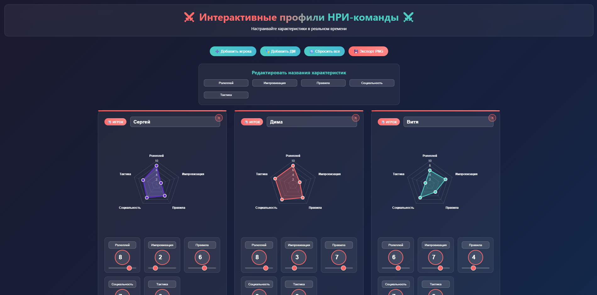
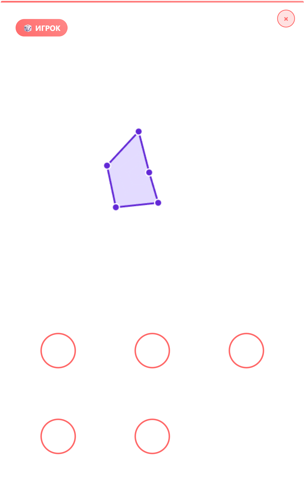
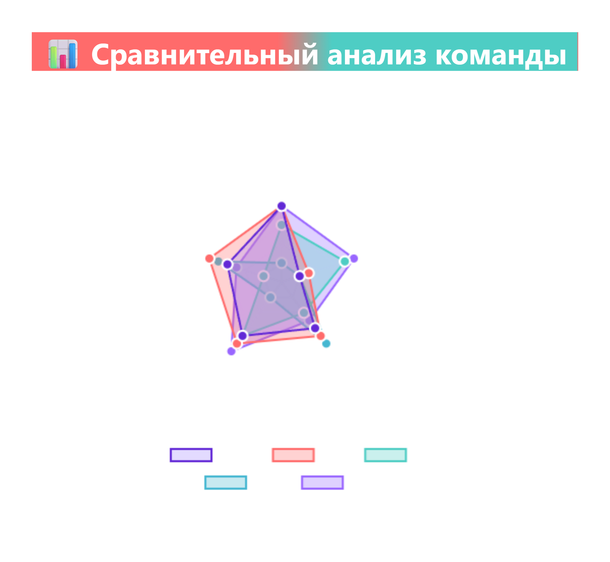

# ⚔️ RPG Team Profiler 🎲

Добро пожаловать в **RPG Team Profiler** — интерактивное веб-приложение для создания и визуализации профилей твоей
НРИ-команды! Хочешь понять, кто в твоей группе мастер ролевого отыгрыша, а кто тактический гений? Или, может, тебе нужно
наглядно показать, почему твой ДМ — настоящий бог импровизации? 😎 Этот инструмент позволит настроить характеристики,
построить крутые радарные диаграммы и экспортировать их в PNG или архив. Бросай d20 и погнали! 🎉

  
   
*(Скриншот интерфейса)*

---

## ✨ Что это за магия?

**RPG Team Profiler** — это веб-приложение для настольных ролевых игр (НРИ), которое помогает:

- Создавать профили игроков и ДМа с кастомными характеристиками (Ролеплей, Импровизация, Правила, Социальность,
  Тактика).
- Визуализировать их с помощью стильных радарных диаграмм 📊.
- Редактировать названия характеристик глобально или для каждого персонажа.
- Экспортировать профили в PNG или все диаграммы в ZIP-архив для эпичных отчётов о кампании.
- Сравнивать команду в одном графике, чтобы увидеть, кто тащит, а кто просто кидает кубики 🎲.

Идеально для ДМов, которые хотят наглядно показать сильные стороны команды, или для игроков, мечтающих похвастаться
своими навыками! 😜

---

## 🚀 Установка

Чтобы запустить этот эпичный инструмент, следуй этим шагам:

1. **Склонируй репозиторий**:
   ```bash
   git clone https://github.com/MrMikki-boop/RPGTeamProfiler.git
   ```

2. **Перейди в папку проекта**:
   ```bash
   cd RPGTeamProfiler
   ```

3. **Установи зависимости**:
   Убедись, что у тебя установлен [Node.js](https://nodejs.org/). Затем выполни:
   ```bash
   npm install
   ```

4. **Запусти локальный сервер**:
   ```bash
   npm install http-server --save-dev
   npx http-server . -p 8080
   ```

5. Открой в браузере `http://localhost:8080`. Брось кубик на удачу и наслаждайся! 🎲

---

## 🎮 Как использовать?

1. **Добавь игрока или ДМа**:
    - Кликни `➕ Добавить игрока` или `🎭 Добавить ДМ`, чтобы создать новый профиль.
    - Введи имя (например, "Грок, мастер хаоса") и настрой характеристики с помощью ползунков.

2. **Настрой характеристики**:
    - Изменяй значения (0–10) для каждой характеристики через поля ввода или ползунки.
    - Хочешь переименовать характеристики? Используй секцию "Редактировать названия характеристик" для глобальных
      изменений или индивидуально редактируй названия прямо в карточке персонажа.

3. **Экспортируй профили**:
    - Кликни `💾 Экспорт PNG` и выбери:
        - **Индивидуальная диаграмма**: Скачай профиль одного персонажа в PNG.
        - **Сравнительный анализ команды**: Получи радарную диаграмму всей команды.
        - **Все диаграммы (архив)**: Скачай ZIP со всеми профилями и сравнением.

4. **Сбрось всё**:
    - Нажми `🔄 Сбросить все`, если кампания пошла не по плану. 😅

---

## 🛠️ Структура проекта

```
RPGTeamProfiler/
├── index.html                  # Основной HTML-файл
├── css/
│   └── styles.css              # Стили для эпичного интерфейса
├── js/
│   ├── script.js               # Логика приложения
│   ├── chart.min.js            # Chart.js для радарных диаграмм
│   ├── html2canvas.min.js      # Для экспорта в PNG
│   ├── jszip.min.js            # Для создания ZIP-архивов
│   └── FileSaver.min.js        # Для скачивания файлов
├── img/                        # Изображения
│   ├── apple-touch-icon.png    # Иконка для iOS (180x180)
│   ├── favicon-16x16.png       # Favicon (16x16)
│   ├── favicon-32x32.png       # Favicon (32x32)
│   ├── site.webmanifest        # Манифест для PWA
│   ├── screenshot.png          # Скриншот сайта
├── package.json                # Зависимости и скрипты
├── README.md                   # Этот файл
├── LICENSE                     # Лицензия MIT
```

---

## 🐉 Требования

- **Node.js**: Для установки зависимостей и запуска сервера.
- Современный браузер (Chrome, Firefox, Edge).
- Немного НРИ-духа! 🎲

---

## 🤝 Contributing

Хочешь добавить фичу? Например, сохранение профилей в JSON или поддержку тёмного режима? 😎

1. Форкни репозиторий.
2. Создай ветку (`git checkout -b feature/awesome-idea`).
3. Закоммить изменения (`git commit -m "Добавил мега-фичу"`).
4. Запушь в ветку (`git push origin feature/awesome-idea`).
5. Открой Pull Request и расскажи, как твоя идея улучшит кампании!

---

## 📜 Лицензия

Этот проект распространяется под лицензией [MIT](LICENSE.txt). Делай с ним что хочешь, но не забывай упомянуть автора! 😄

---